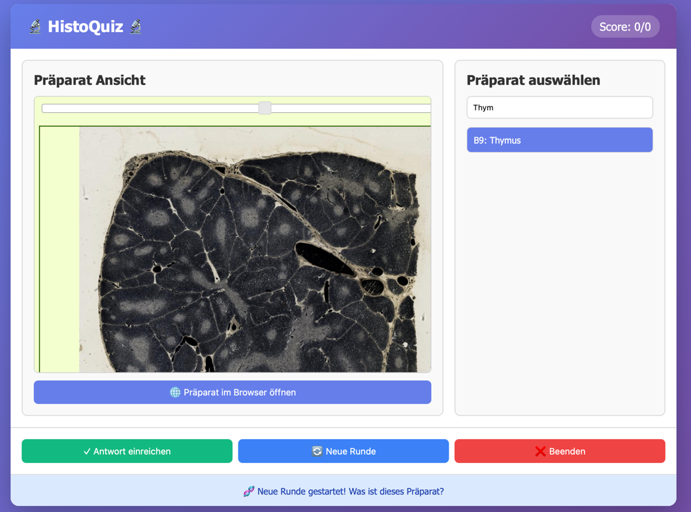

# HistoQuiz 🔬

Ein interaktives Quiz zum Lernen der histologischer Präparate für die mikroskopische Anatomie Prüfung für Studierende der Medizinischen Physik und Ernährungswissenschaften.



## Was brauchst du?

- **Python 3.6 oder höher** - kostenlos unter [python.org/downloads](https://www.python.org/downloads/)
  - **Windows**: Bei der Installation "Add Python to PATH" ankreuzen!
  - **Mac/Linux**: Meist schon installiert

## Wie startest du das Programm?

### Option 1: Mit Python (empfohlen für Entwicklung)

1. Lade das Projekt herunter (grüner "Code"-Button → "Download ZIP")
2. Entpacke die ZIP-Datei
3. Öffne ein Terminal/Kommandozeile im Projekt-Ordner
4. Führe aus:
   ```bash
   python3 main.py
   ```
5. Der Browser öffnet sich automatisch mit dem Quiz!

### Option 2: Mit kompilierter Executable (ohne Python Installation)

Wenn du Python nicht installieren möchtest, kannst du eine standalone Executable erstellen:

#### Mit Docker + Makefile (empfohlen für Linux und Windows):

Erstelle Executables mit Docker (benötigt Docker Desktop):

**Für eine spezifische Plattform:**
```bash
make linux    # Baut für Linux
make windows  # Baut Windows .exe
```

**Für beide Plattformen:**
```bash
make all
```

Die Executables findest du unter:
- Linux: `dist-docker/linux/HistoQuiz`
- Windows: `dist-docker/windows/HistoQuiz.exe`

**Hinweis zu macOS:** macOS Executables können nicht cross-kompiliert werden. Verwende auf macOS die native Build-Methode unten.

**Voraussetzungen:** Docker und docker-compose müssen installiert sein.

#### Alternative Methode (Native Build-Skripte):

**Windows:**
1. Öffne die Kommandozeile im Projekt-Ordner
2. Führe aus: `build_windows.bat`
3. Die Executable findest du dann unter `dist\HistoQuiz.exe`

**Linux/Mac:**
1. Öffne ein Terminal im Projekt-Ordner
2. Führe aus: `./build_unix.sh`
3. Die Executable findest du dann unter `dist/HistoQuiz`

**Hinweis:** Zum Kompilieren der Executable wird Python vorübergehend benötigt. Die fertige Executable läuft dann aber ohne Python Installation.

## Spielanleitung

1. Ein zufälliges Präparat wird angezeigt
2. Klicke auf "Präparat im Browser öffnen", um es anzusehen
3. Suche in der Liste das richtige Präparat (Suchfunktion verfügbar)
4. Klicke auf deine Auswahl (wird blau markiert)
5. Klicke auf "Antwort einreichen"
6. Bei richtiger Antwort startet automatisch die nächste Runde

**Beenden:** Drücke `Strg+C` im Terminal
