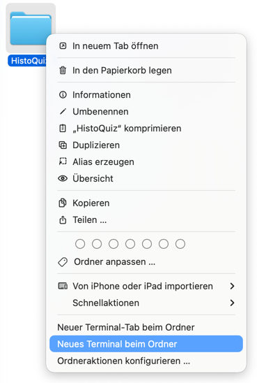
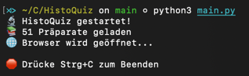

# HistoQuiz 🔬

Ein interaktives Quiz zum Lernen der histologischen Präparate für die mikroskopische Anatomie Prüfung für Studierende der Medizinischen Physik und Ernährungswissenschaften.
Alle Bilder stammen vom Onlinemikskop der Martin-Luther-Universität Halle-Wittenberg [Histo-Online](https://histohal.uni-halle.de/).

## Was brauchst du?

- **Python 3.6 oder höher** - kostenlos unter [python.org/downloads](https://www.python.org/downloads/)
  - **Windows**: Bei der Installation "Add Python to PATH" ankreuzen!

## Wie startest du das Programm?

1. Lade das Projekt herunter (blauer oder grüner "Code"-Button oben rechts → "Download ZIP")
2. Entpacke die ZIP-Datei
3. Unter Windows kannst du im entpackten Ordner doppelt auf **RUN_WINDOWS.bat** klicken.
4. Falls das nicht funktioniert oder du einen Mac oder Linux hast, musst du das Programm im Terminal starten. Öffne dazu ein Terminal/Kommandozeile und navigiere zum entpackten Ordner.
5. Wie du dich im **Windows** Terminal bewegst, kannst du [hier](https://www.wikihow.com/Change-Directories-in-Command-Prompt) nachlesen. 
6. Für **MacOs** kannst du direkt im Finder "Neues Terminal beim Ordner" auswählen 
7. Falls du **Linux** nutzt, gehe ich davon aus, dass du weißt, wie man das Terminal benutzt.
8. Führe im entpackten Ordner `python3 main.py` aus. 

7. Der Browser öffnet sich automatisch mit dem Quiz!

## Was, wenn es Fehler im Programm gibt?

Das Programm ist durch den Einsatz von Vibecoding entstanden und ich übernehme keine Haftung für die Richtigkeit der Zuordnung zwischen Bild und Präparat.
Falls du einen Fehler entdeckt oder eine Frage hast, erstelle gerne ein [Issue](https://github.com/hannrei/HistoQuiz/issues).
